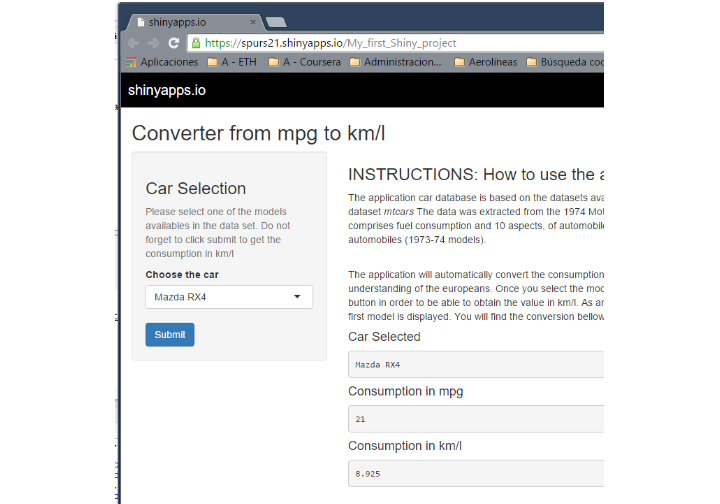
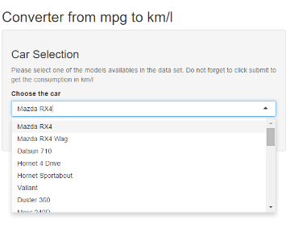
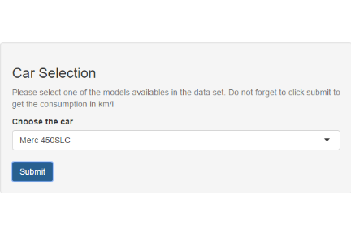
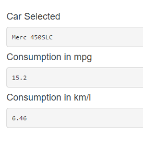

## Introduction and Motivation

The application car database is based on the datasets availables in R. In particular, the dataset, *mtcars* The data was extracted from the 1974 Motor Trend US magazine, and comprises fuel consumption and 10 aspects of automobile design and performance for 32 automobiles (1973-74 models).

It is well know that the different units used in europe, EEUU and United Kingdon create many confusions
among researchers and data scientists. They loose much time converting units in order to be able the transfer their knowledge to their colleagues in an easy way.

In order to bring clarity to the data available in mtcars dataset I wanted to create a tool capable of automatically convert the consumption of the vehicles from mpg to km/l.

--- .class #id 

## Browsing the APP: Consumption Converter layout

[Consumption Converter App Hosted by shinyapps.io ](https://spurs21.shinyapps.io/My_first_Shiny_project)

--- .class #id 

## Instruction of the application

The application will automatically convert the consumption from mpg to km/l for a better understanding, for instance, of the europeans. Once you select the model, you have to click in submit button in order to be able to obtain the value in km/l. As an example, the conversion for the first model is displayed. You will find the conversion bellow the       instructions in the mainPanel on the right.

[Link to Github repository](https://spurs21.shinyapps.io/My_first_Shiny_project)

# First Step: Select the car

--- &two
## Instruction of the application  

*** =left

# Second Step: Select the car and click "Submit"

*** =right

# Third step: your selection will be updated

